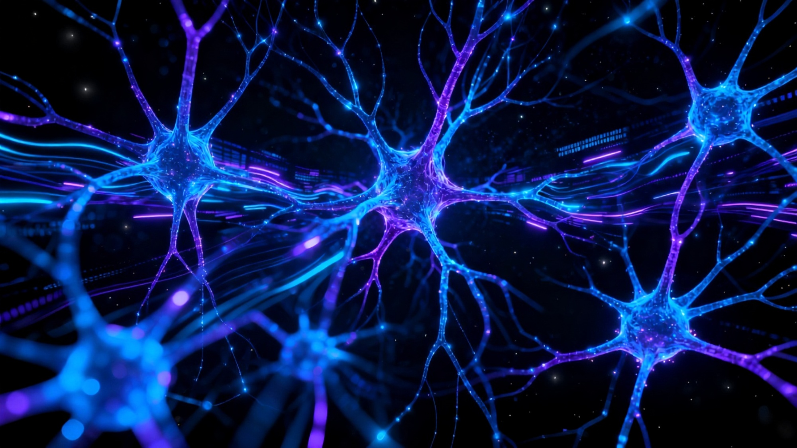
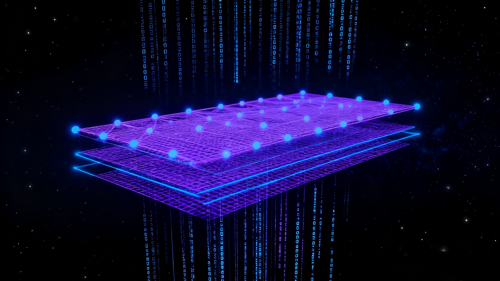
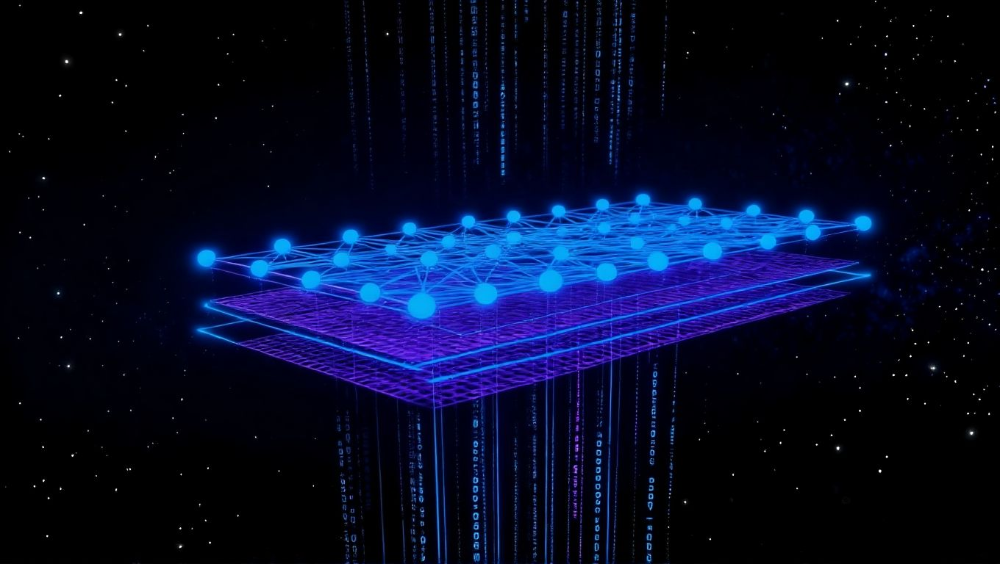
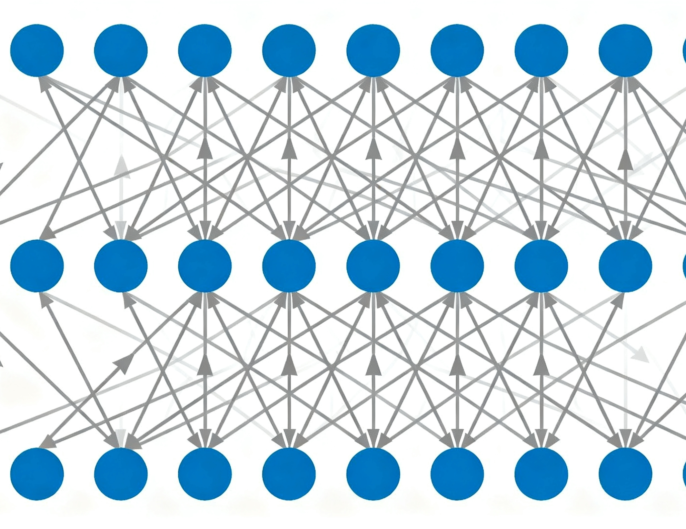
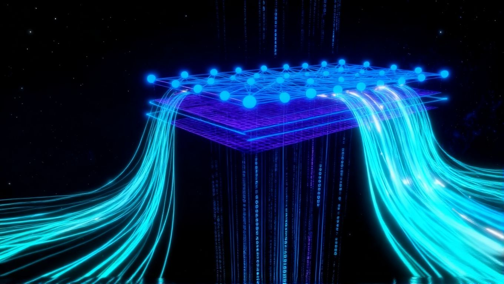
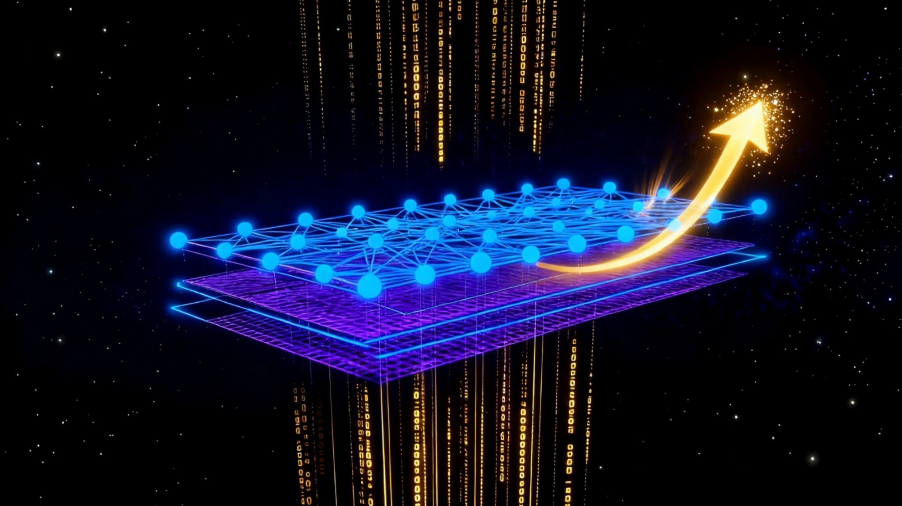
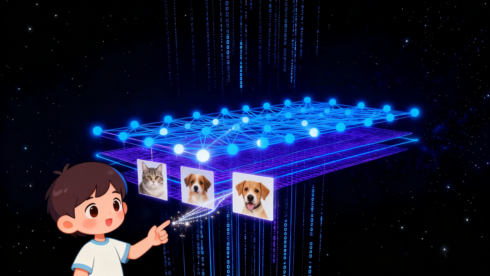
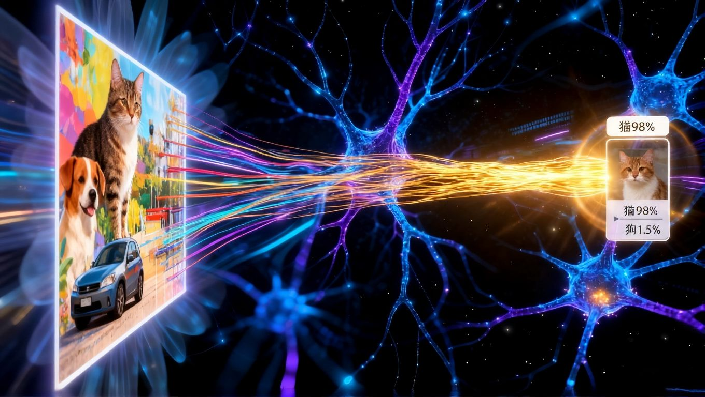
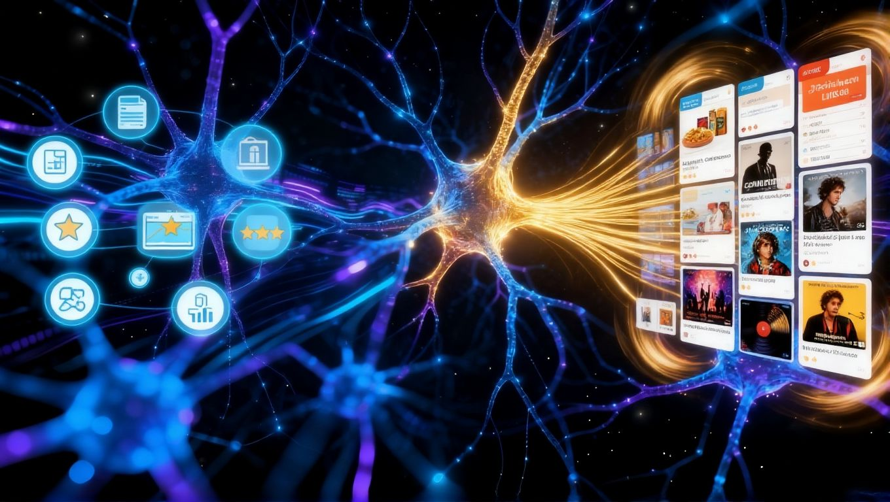

# :robot:揭秘AI大脑的核心：神经网络:tada:
::: tip :question:AI是如何做到识别面孔、理解语言，甚至下棋战胜人类顶尖选手的?:question:
::: details 点击查看答案

::: tip :100:回答：<strong>神经网络（Neural Network）</strong>是一种模拟人脑神经元工作原理的计算模型，用于处理和分析复杂的模式和数据。它由多个神经元层组成，每个神经元都与前一层的神经元相连，通过调整连接的权重和阈值，实现对输入数据的处理和输出。
:::
## 什么是神经网络？

#### 你可以把它想象成一个受到人脑结构和功能启发而设计的计算模型。它并非一个单一的程序，而是一个由无数个相互连接的“神经元”（或称节点）组成的复杂网络。

这些神经元分层排列，通常包括：

#### - 输入层：接收外部输入数据，例如图像、语音或文本。

#### - 隐藏层：在输入层和输出层之间，进行复杂的特征提取和转换。

#### - 输出层：产生最终的预测或决策。

#### 每个神经元都与前一层的所有神经元相连，并且每个连接都有一个关联的权重。当输入数据进入网络时，它会通过这些连接进行传递和处理，最终在输出层产生结果。

## 它是如何学习的？

#### 神经网络最神奇之处在于它的学习能力。信息在这些神经元之间传递，每个连接都有一个“权重”，就像信号的强度。神经网络通过接收大量的数据（比如成千上万张猫和狗的图片），然后根据这些数据的正确答案来不断调整和优化内部的连接强度（权重）。
##### 神经网络数据

#### 这个过程有点像一个孩子通过反复练习和纠正来学习识别<strong>猫</strong>和<strong>狗</strong>：一开始可能会犯错，但随着经验的积累，它会越来越准确地识别出猫和狗的特征。当神经网络经过充分训练后，它就能从新的、未见过的数据中识别出模式、做出预测或分类。

#### 神经网络通过数据的日积月累来学习和改进。它会根据错误的预测来调整连接的权重，使得下一次预测更加准确。这个过程被称为“训练”，而训练的结果是一个能够在新数据上表现出高准确性的神经网络模型。

## 为什么它如此强大？
#### 正是这种强大的学习能力和模式识别能力，让神经网络在众多领域大放异彩：
#### 图像识别： 手机解锁、自动驾驶中的物体检测、医疗影像分析，人脸识别等。

#### 语音识别： 智能音箱、语音助手、实时字幕。

#### 自然语言处理： 机器翻译、智能客服、文本摘要、情感分析。

#### 推荐系统： 购物网站、视频平台的个性化推荐。

#### 预测分析： 金融风险评估、天气预报、市场趋势预测。

#### 与AI的关系

## 结语
#### 从简单的模式识别到复杂的决策制定，神经网络是现代人工智能技术的核心驱动力之一。它不断进化，正以前所未有的方式改变着我们的世界，开启智能化的无限可能，让我们对未来充满期待！
## 总结
#### 神经网络是一种模拟人脑神经元工作原理的计算模型，用于处理和分析复杂的模式和数据。它由多个神经元层组成，每个神经元都与前一层的神经元相连，通过调整连接的权重和阈值，实现对输入数据的处理和输出。
#### 神经网络最神奇之处在于它的学习能力。通过接收大量的数据，神经网络可以根据正确答案不断调整和优化内部的连接强度（权重），从而实现对模式的识别和预测。
#### 正是这种强大的学习能力和模式识别能力，让神经网络在众多领域大放异彩，包括图像识别、语音识别、自然语言处理、推荐系统和预测分析等。
#### 从简单的模式识别到复杂的决策制定，神经网络是现代人工智能技术的核心驱动力之一。它不断进化，正以前所未有的方式改变着我们的世界，开启智能化的无限可能，让我们对未来充满期待！
## 参考资料
#### 1. [DLB(DeepLearningBook)-神经网络基础](https://www.deeplearningbook.org/contents/ml.html)
#### 2. [掘金-神经网络基础](https://juejin.cn/post/7086418686176837669?searchId=20250924221923DF9CD9E82A3F2127E4BD)
#### 3. [掘金-神经网络与卷积神经网络](https://juejin.cn/post/7224514908761669689?searchId=20250924221923DF9CD9E82A3F2127E4BD)
#### 4. [掘金-神经网络基础：从零实现全连接网络](https://juejin.cn/post/7224514908761669689?searchId=20250924221923DF9CD9E82A3F2127E4BD)
#### 5. [掘金-神经网络基础：循环神经网络基本知识](https://juejin.cn/post/7126455327901351944?searchId=20250924221923DF9CD9E82A3F2127E4BD)
## 鸣谢
#### 感谢 DLB 提供的神经网络基础课程，感谢掘金的文章作者，感谢所有参与神经网络研究和开发的人。
#### 感谢掘金网友的分享和反馈，帮助我更好地理解和应用神经网络。
#### 感谢 GitHub 社区的开源贡献者，他们的代码和项目为本文提供了宝贵的参考。
#### 感谢 Stack Overflow 社区的技术支持，解答了我在学习过程中遇到的诸多问题。
#### 感谢 AI研究领域的先驱者们，是他们的不懈努力推动了神经网络技术的发展。
#### 感谢所有阅读和支持本文的读者，你们的反馈是我持续改进的动力。
## 版权声明
#### 本文章采用 [MIT](./license.md) 协议进行许可，转载请注明出处。
#### 本文章版权归作者所有，未经授权，禁止任何形式的转载和使用。
#### 本文章中的所有内容（包括但不限于文字、图片、代码等）均受版权法保护。
#### 如需转载或使用本文章内容，请事先获得作者书面许可。
#### 本文章采用 [MIT](./license.md) 协议进行许可，在遵守协议的前提下可以自由使用。
#### 使用本文章内容时，必须注明作者和出处。
#### 对于违反版权声明的行为，作者保留追究法律责任的权利。
## 联系我
#### 如果你有任何问题、建议或合作机会，请随时联系我。我会尽力回答你的问题并与你合作。
#### 邮箱：[lxy130523@outlook.com](mailto:lxy130523@outlook.com)
#### 微信：lxyCoding2147483647
