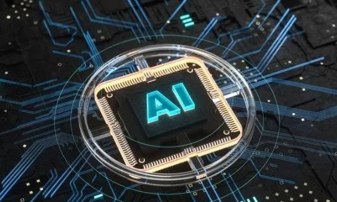
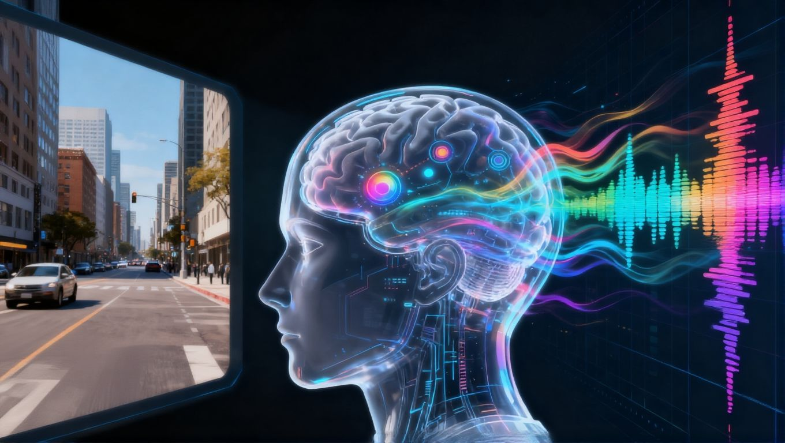
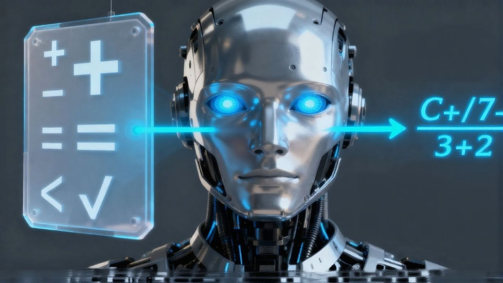
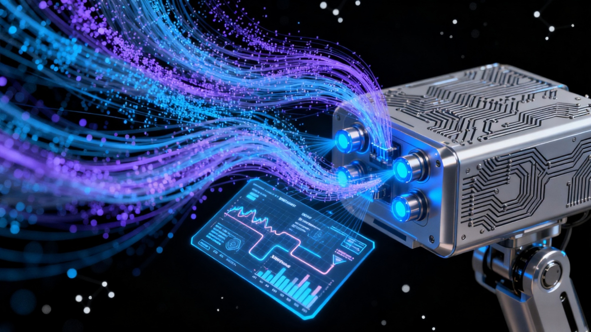
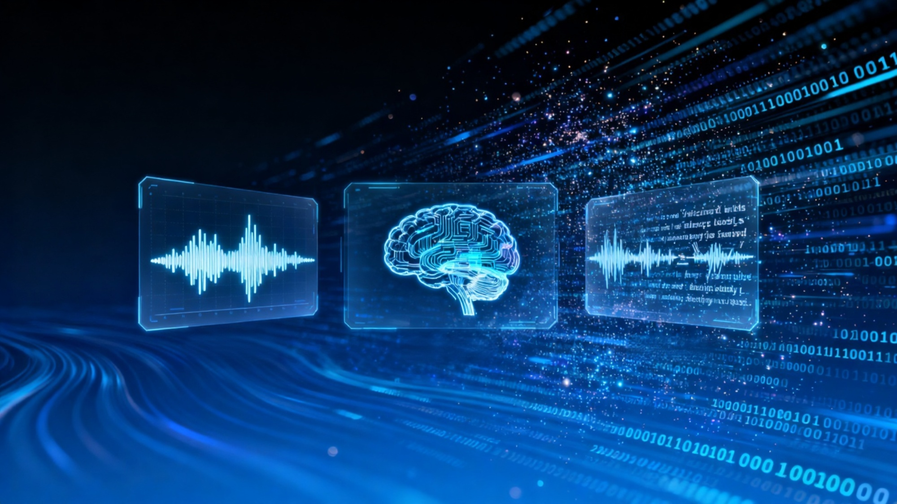
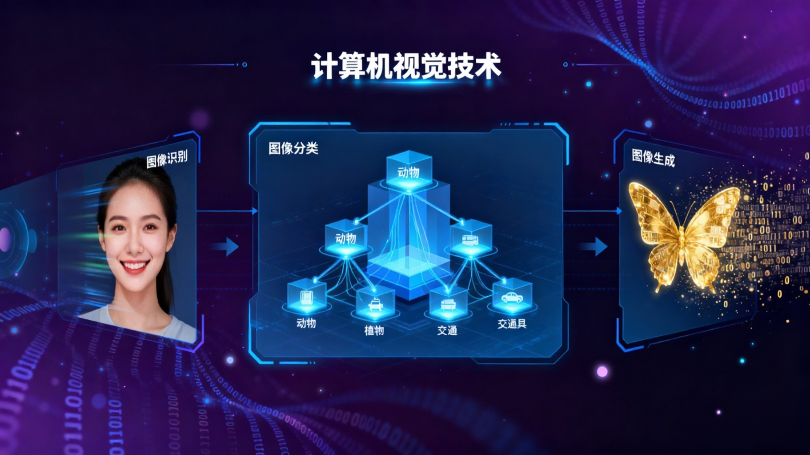
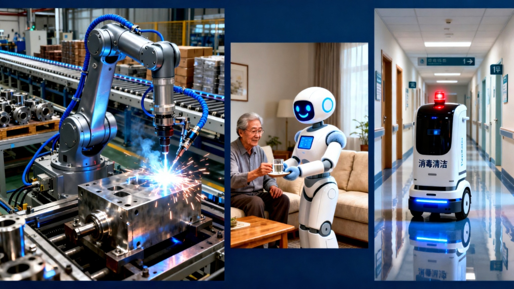

# :robot:信息课展示AI:robot:

::: tip :question:问题：谁知道AI是什么意思？:question: :::
::: details 点击查看答案

::: tip :100:回答：人工智能（Artificial Intelligence，简称AI） 是一门研究、开发能够模拟、延伸和扩展人类智能的理论、方法、技术及应用系统的科学。它的核心目标是让机器像人一样思考、学习、理解、推理、感知和决策，从而解决复杂问题。
:::
## AI的5种能力：
### 1. 感知能力: 通过计算机视觉、语音识别等技术，让机器能够“看”和“听”。

### 2. 理解能力: 尤其是对自然语言的理解，使机器能与人类进行有效沟通。

### 3. 推理能力: 能够根据已有的信息和知识，通过逻辑推理和模式匹配，得出新的结论。

### 4. 学习能力: 能够通过不断的训练和数据输入，提升自己的性能和能力。

### 5. 决策能力: 能够根据已有的知识和经验，在复杂的环境中进行决策和选择。

## AI的主要分支领域
### 1. 机器学习: 是一种让机器能够自动学习和改进的技术，通过对数据的分析和模式识别，使机器能够进行预测和决策。

### 2. 深度学习: 是一种基于人工神经网络的机器学习技术，能够模拟人脑的工作原理，实现对复杂数据的处理和分析。

### 3. 自然语言处理: 是一种让机器能够理解和处理人类语言的技术，包括语音识别、语音合成、文本分析等。

### 4. 计算机视觉: 是一种让机器能够理解和处理图像和视频的技术，包括图像识别、图像分类、图像生成等。

### 5. 机器人: 是一种能够模拟和执行人类行为的智能设备，包括工业机器人、服务机器人、移动机器人等。

## AI的应用领域
### 1. 医疗健康: 包括疾病诊断、药物研发、智能医疗设备等。
### 2. 交通出行: 包括智能交通系统、智能导航、智能交通灯等。
### 3. 教育领域: 包括智能教育系统、智能学习助手、在线教育平台等。
### 4. 个人领域: 包括智能个人助手、智能个人设备等。
### 5. ……

## AI的未来发展（总结）
### 1. AI将继续发展壮大，成为社会的重要力量。
### 2. AI将在医疗、金融、交通、教育等领域发挥重要作用。
### 3. AI将为社会带来更多的便利和效益。
### 4. AI将带来更多的机会和挑战，需要我们共同努力解决。

## 总结
### 1. AI的发展趋势
### 1.1 人工智能将继续发展壮大，成为社会的重要力量。
### 1.2 人工智能将在医疗、金融、交通、教育等领域发挥重要作用。
### 1.3 人工智能将为社会带来更多的便利和效益。
### 1.4 人工智能将带来更多的机会和挑战，需要我们共同努力解决。
### 2. AI的应用领域
### 2.1 医疗健康
### 2.2 交通出行
### 2.3 教育领域
### 2.4 个人领域
### 3. AI的未来发展
### 3.1 人工智能将继续发展壮大，成为社会的重要力量。
### 3.2 人工智能将在医疗、金融、交通、教育等领域发挥重要作用。
### 3.3 人工智能将为社会带来更多的便利和效益。
### 3.4 人工智能将带来更多的机会和挑战，需要我们共同努力解决。

## 参考资料
### 1. [百度百科-人工智能](https://baike.baidu.com/item/人工智能/9180)  
### 2. [维基百科-人工智能](https://zh.wikipedia.org/wiki/人工智能)
### 3. [中国科学院计算技术研究所-人工智能](https://www.cstip.cn/ai.html)
### 4. [清华大学-人工智能](https://www.tsinghua.edu.cn/ai/)
### 5. [斯坦福大学-人工智能](https://ai.stanford.edu/)
### 6. [麻省理工学院-人工智能](https://www.mit.edu/~icml/)
### 7. [斯坦福大学-深度学习](https://deeplearning.stanford.edu/)
### 8. [斯坦福大学-自然语言处理](https://nlp.stanford.edu/)
### 9. [斯坦福大学-计算机视觉](https://vision.stanford.edu/)
### 10. [斯坦福大学-机器人](https://robotics.stanford.edu/)

## 鸣谢
### 1. 感谢百度百科、维基百科、中国科学院计算技术研究所、清华大学、斯坦福大学等机构的开放资源，为AI的发展做出了贡献。
### 2. 感谢所有参与AI研究和开发的科学家、工程师、学生等，为AI的发展做出了重要的贡献。
### 3. 感谢所有支持AI发展的组织、公司、政府等，为AI的发展做出了重要的支持。
### 4. 感谢所有使用AI技术的用户，为AI的发展做出了重要的贡献。

## 版权声明
### 1. 本项目的代码和文档均采用MIT开源协议，您可以在遵守协议的前提下自由使用、修改和分发。
### 2. 本项目的代码和文档均不包含任何商业用途的内容，您不能将其用于商业目的。
### 3. 本项目的代码和文档均不包含任何形式的 WARRANTY，您不能对其进行任何形式的担保。
### 4. 本项目的代码和文档均不包含任何形式的 MERCHANTABILITY 或 FITNESS FOR A PARTICULAR PURPOSE，您不能对其进行任何形式的担保。
### 5. 本项目的代码和文档均不包含任何形式的 LIABILITY 或 TORT，您不能对其进行任何形式的担保。
### 6. 本项目由LiuXiyu（现实名称--刘熙宇）、核巨啸（现实名称--王梓臣），chao-smile（现实名称--付*超）三人共同维护，版权所有 Copyright (c) 2024 (Github)MEMZ-CHROER，LiuXiYu，核巨啸，保留所有权利。防盗必究
### 7. 您不能将本项目的代码和文档用于任何形式的商业用途，包括但不限于销售、出租、许可等。
### 8. 您不能将本项目的代码和文档用于任何形式的非法用途，包括但不限于侵犯他人权益、破坏社会秩序等。
### 9. 您不能将本项目的代码和文档用于任何形式的恶意用途，包括但不限于攻击、破坏、窃取等。
### 10. 您不能将本项目的代码和文档用于任何形式的政治用途，包括但不限于政治宣传、政治攻击等。
### 11. 您不能将本项目的代码和文档用于任何形式的宗教用途，包括但不限于宗教宣传、宗教攻击等。
### 12. 您不能将本项目的代码和文档用于任何形式的法律用途，包括但不限于法律宣传、法律攻击等。
### 13. 您不能将本项目的代码和文档用于任何形式的技术用途，包括但不限于技术宣传、技术攻击等。
### 版权所有 保留所有权利 结