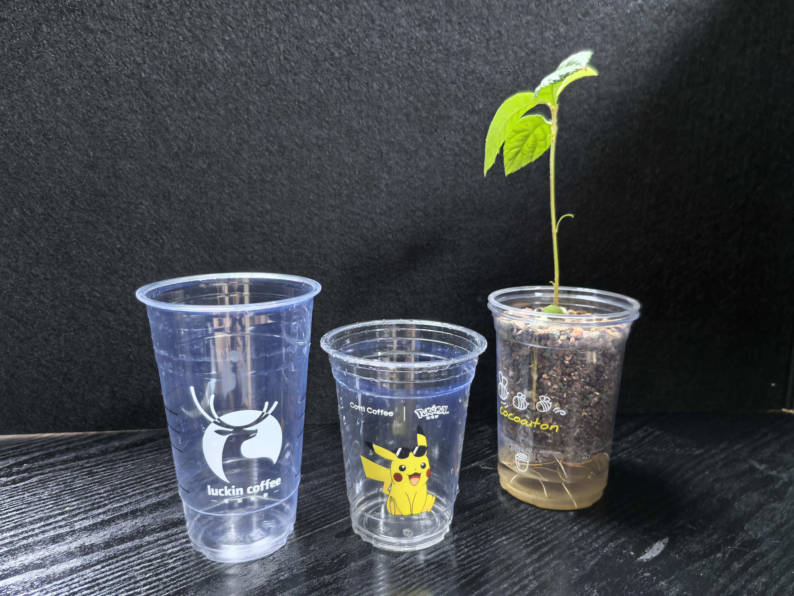
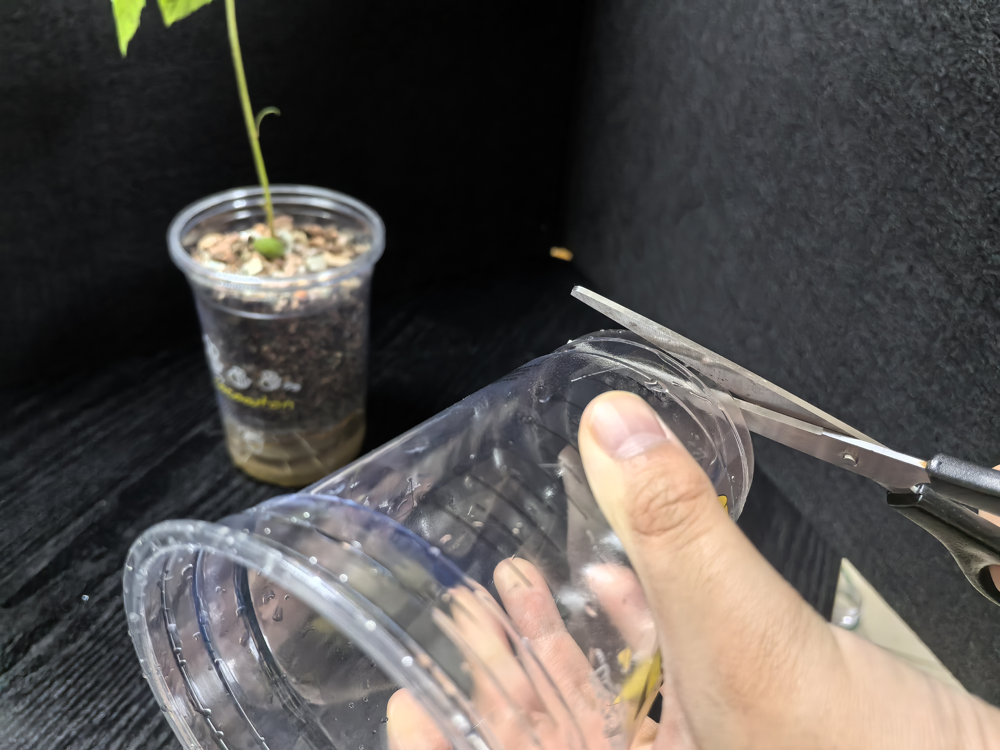
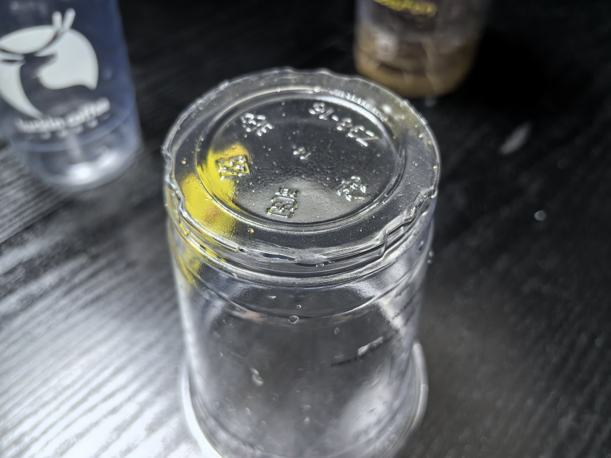
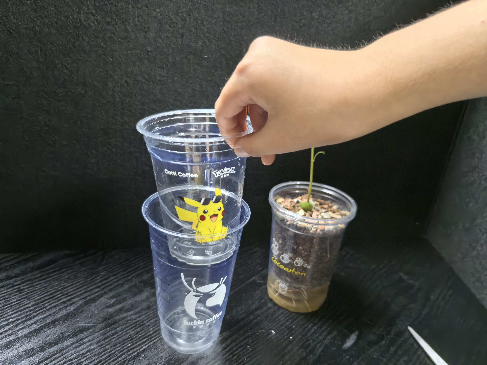
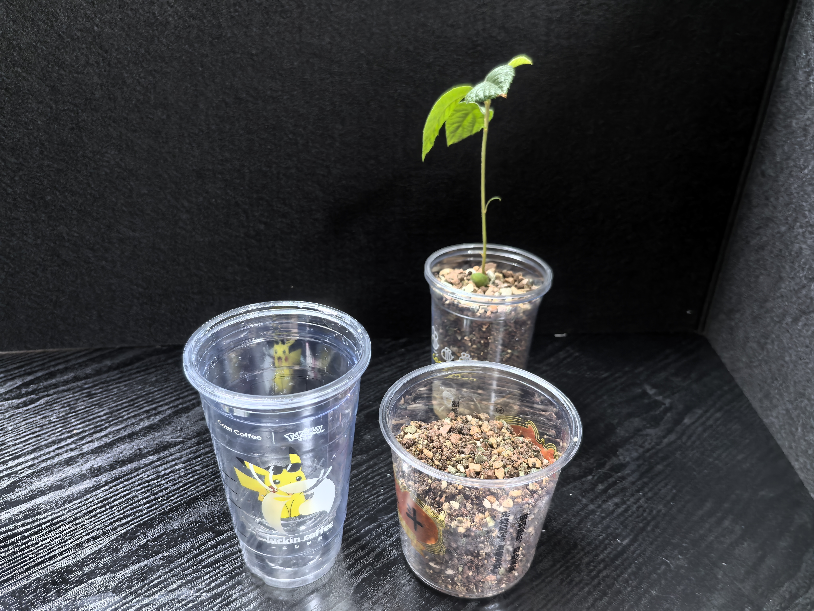
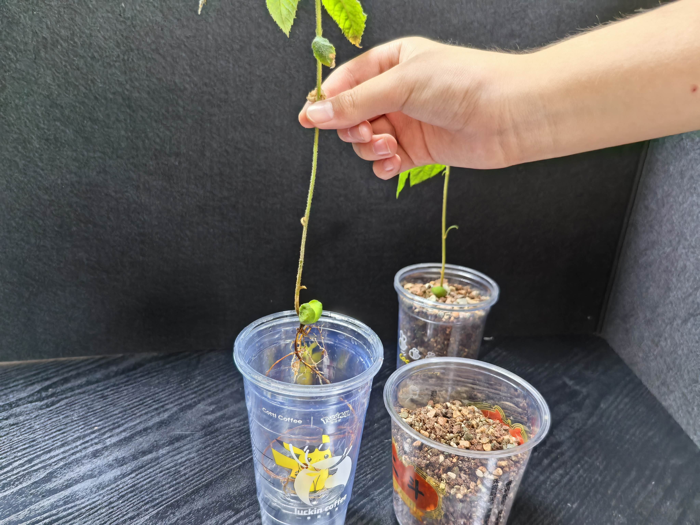
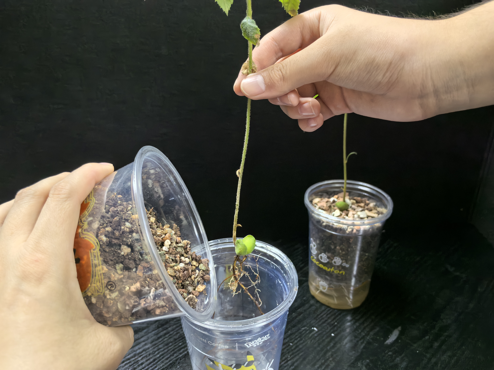

# 土培
## 土培过程
### 1. 准备两个空奶茶杯，需要一个大的和一个小的，以下简称大的是1号杯，小的是2号杯

### 2. 把2号杯的底下剪几个孔，方便根系透气

### 3. 剪完孔如下图

### 4. 把2号杯套进1号杯，如下图

### 5. 准备一些土壤

### 6. 轻轻的把要种植的植物的根系放进2号杯，手拿着植物本体

### 7. 沿着植物边缘转着圈倒土壤，直到土壤倒满，植物的根系会相当稳固

### 8. 最后浇一些水，制作完成

