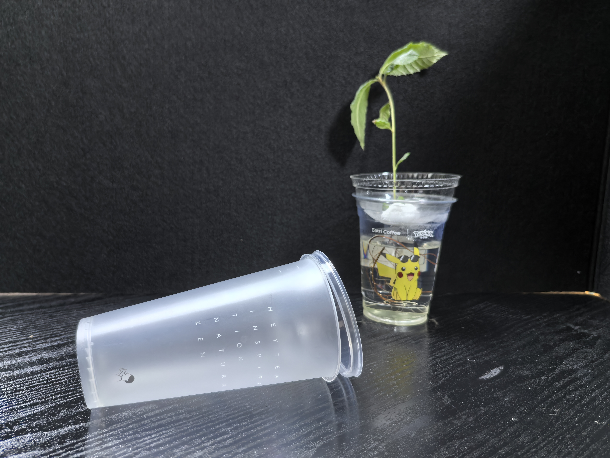
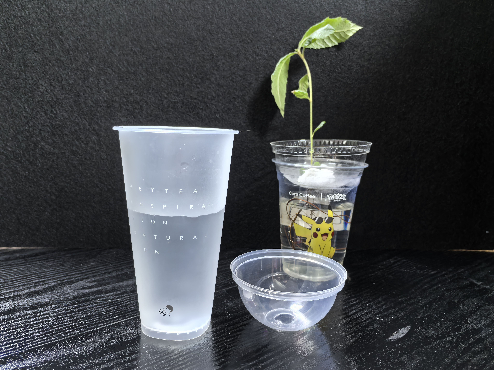
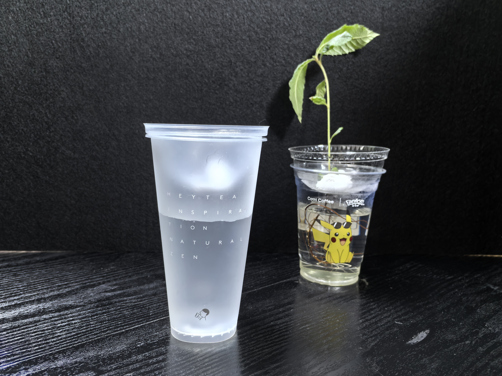
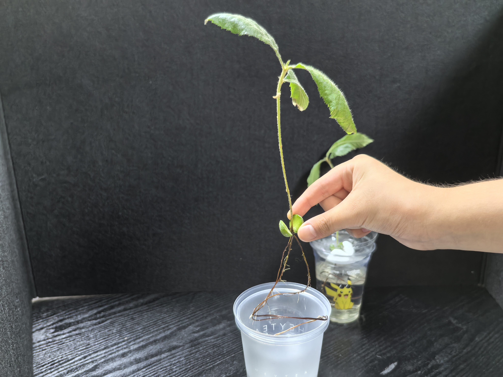
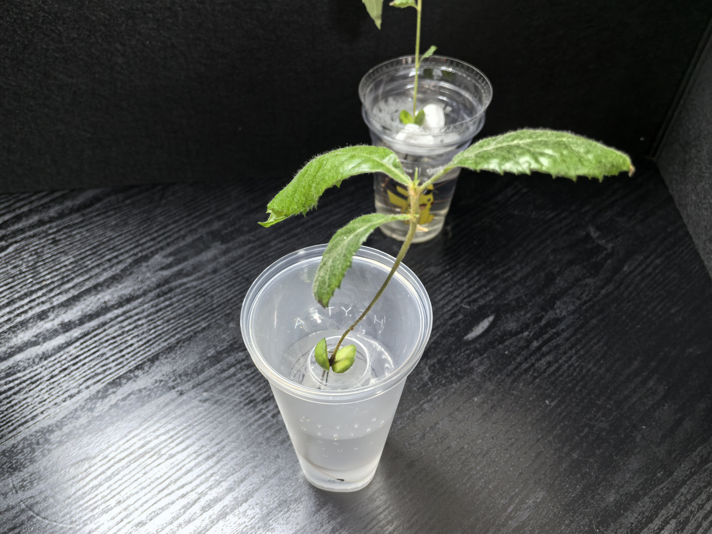
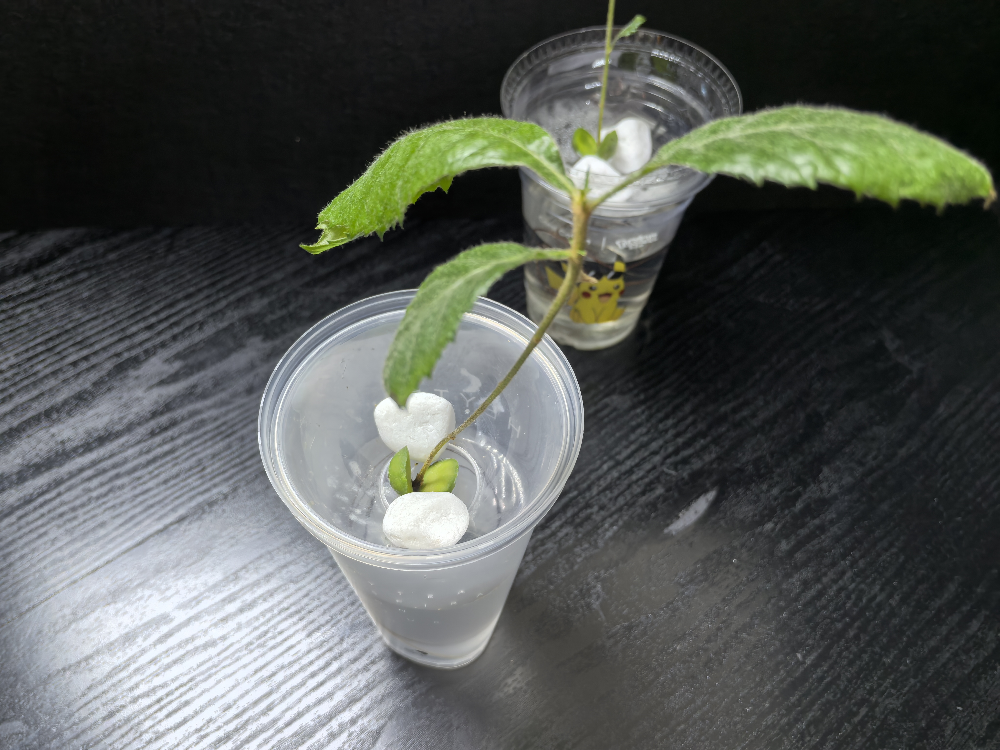
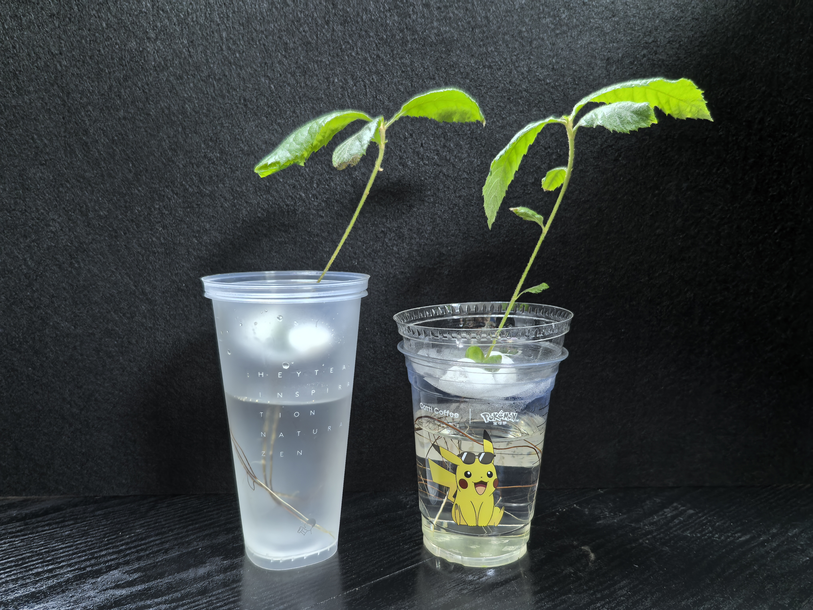

# 水培
## 水培过程
### 1. 准备一个奶茶杯（圆盖）

### 2. 测试奶茶杯的圆盖能否倒扣进奶茶杯

### 3. 在奶茶杯中放入水

### 4. 倒扣盖上圆盖

### 5. 小心翼翼的将植物的根系插入奶茶杯圆盖的吸管孔

### 6. 植物放进去了以后如图所示

### 7. 取出两块造景石

### 8. 用造景石压住植物，防止植物跑偏

### 9. 如图，制作完成

